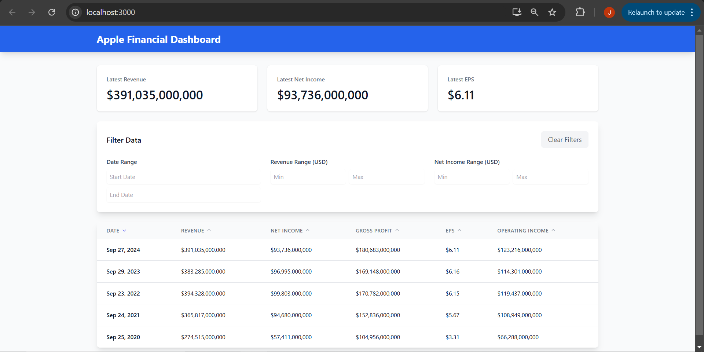

# Financial Data Filter App

A React-based web application for visualizing and analyzing Apple Inc.'s financial data using the Financial Modeling Prep API.

Live Demo: [https://financial-filter-fiy7sr7di-tommy-boyajians-projects.vercel.app/](https://financial-filter-fiy7sr7di-tommy-boyajians-projects.vercel.app/)

Screenshot: 

## Features

- Display Apple Inc.'s annual income statements
- Interactive data filtering:
  - Date range selection
  - Revenue range filtering
  - Net Income range filtering
- Sortable data columns
- Real-time data visualization
- Responsive design for both desktop and mobile

## Technologies Used

- React.js
- Tailwind CSS
- Axios for API requests
- React DatePicker
- Financial Modeling Prep API
- HeroIcons
- Vercel for deployment

## Installation

1. Clone the repository:
   ```bash
   git clone [your-repository-url]
   cd financial-filter-app
   ```

2. Install dependencies:
   ```bash
   npm install
   ```

3. Create a `.env` file in the root directory and add your API key:
   ```
   REACT_APP_FMP_API_KEY=your_api_key_here
   ```

4. Start the development server:
   ```bash
   npm start
   ```

## Usage

After starting the development server:
1. Open http://localhost:3000 in your browser
2. Use the date range picker to filter by specific time periods
3. Enter minimum and maximum values for Revenue and Net Income filters
4. Click on column headers to sort the data
5. View the formatted financial data in the table

## API Configuration

This project uses the Financial Modeling Prep API. To use the application:
1. Sign up for an API key at [Financial Modeling Prep](https://site.financialmodelingprep.com/)
2. Add your API key to the `.env` file

## Project Structure

```
financial-filter-app/
├── src/
│   ├── components/
│   │   ├── DataTable.jsx
│   │   └── FilterSection.jsx
│   ├── services/
│   │   └── api.js
│   └── App.js
├── public/
└── README.md
```

## Deployment

This app is deployed using Vercel. To deploy your own version:

1. Fork this repository
2. Sign up for Vercel
3. Import your repository
4. Add your environment variables in Vercel:
   - REACT_APP_FMP_API_KEY=your_api_key
5. Deploy!

## Development

To work on this project:

1. Fork the repository
2. Create a new branch for your feature
3. Make your changes
4. Submit a pull request

## Future Enhancements

- Add more financial metrics
- Implement data visualization charts
- Add export functionality
- Include more companies
- Add user authentication

## License

[MIT License](LICENSE)